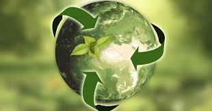

# Hackathon
# 🌱 Sustainable Resource Management

> Empowering a greener future through intelligent resource management and responsible practices.

 <!-- Replace with your own banner image -->

---

## 🌍 Overview

Sustainable Resource Management (SRM) is the discipline of efficiently managing natural resources—such as water, energy, land, and biodiversity—to meet current needs without compromising the ability of future generations to meet theirs.

This project is a knowledge hub and toolkit for researchers, students, and developers working in environmental science, policy planning, or eco-conscious application development.

---

## 🔧 Features

- ♻️ **Frameworks & Models**: Explore strategies for managing water, energy, and waste sustainably.
- 📊 **Data-Driven Tools**: Sample datasets and visualizations for impact analysis.
- 🧠 **Educational Resources**: Articles, tutorials, and case studies on best practices.
- 🌐 **Open Source API** (Coming soon): Easily integrate sustainability data into your applications.

---

## 📁 Repository Structure

